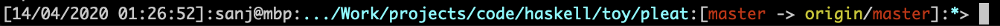

# pleat

Your Bash prompt - but in Haskell! **Haskell your Bash** whenever possible.

[](https://travis-ci.org/ssanj/pleat) [](https://github.com/ssanj/pleat/releases/latest)

## Installing

### Mac

Download the [latest release](https://github.com/ssanj/pleat/releases/download/v0.2.0.5/pleat-v0.2.0.5-osx.tar.gz) from the releases page.

### Linux


Download the [latest release](https://github.com/ssanj/pleat/releases/download/v0.2.0.5/pleat-v0.2.0.5-linux.tar.gz) from the releases page.

In addition you can build it from source and install it locally with Stack:

```
stack build --fast && stack install
```

## Configuring

Once you have the `pleat` executable on your path, you need to tell Bash to use it to render its prompt. You can do this via the following scripts or use another technique that works for you.


1. Define the [~/.bash_prompt](https://stackoverflow.com/questions/3058325/what-is-the-difference-between-ps1-and-prompt-command) script that specifies how the prompt should be created:


```
function prompt_command {
  export PS1=$(PATH_TO_pleat)
}
export PROMPT_COMMAND=prompt_command
```

2. Source the above script from your `bash_profile`:

```
source ~/.bash_prompt
```

## Using

You can display all help information for pleat with:

```
pleat -h
```

or

```
pleat --help
```

which will yield all the options:

```
pleat - Your Bash prompt in Haskell

Usage: pleat ([--no-hostname] | [--hostname HOSTNAME]) ([--no-path] |
             [--max-path-length INT]) [--no-git] [--no-timestamp]
             [--prompt PROMPT] [--prompt-separator SEP] [-v|--version]

Available options:
  --no-hostname            don't display hostname
  --hostname HOSTNAME      override hostname
  --no-path                don't display path
  --max-path-length INT    maximum length for the path displayed (default: 50)
  --no-git                 don't display git
  --no-timestamp           don't display timestamp
  --prompt PROMPT          override prompt (default: "> ")
  --prompt-separator SEP   override prompt separator (default: ":")
  -v,--version             Show pleat version
  -h,--help                Show this help text

---
```

### Prompt components

pleat has the following components:

| Field | What is it? |
|-------|-------------|
| Timestamp | Current date and time                        |
| User      | Logged in user                               |
| Hostname  | Computer name                                |
| Path      | Current working directory                    |
| Git       | Git information; See below                   |
| Prompt    | String at the end of the prompt line         |

###  With defaults

```
pleat
```

which dumps out something like:



### Hostname

Displays the hostname of the computer.

You can remove the **hostname** completely with `--no-hostname` or set it to a default value with `--hostname 'my-cool-hostname'` if you don't like the actual **hostname** of your computer.

These options are mutually exclusive so you can't specify them together. If they
are both omitted the actual hostname of the computer is used.

### Path

Displays the current working dictory

Is the path getting you down? Remove it with `--no-path` or truncate the path if it's too long with `--max-path-length SIZE`.

These are mutually exclusive. If they are both omitted the full path to the current directory will be used and truncated to a default length of 50 characters.

### Git

Displays Git information if the current directory is a Git repository:
- Local branch name
- Local modifications
- Remote branch name
- Pending commits not pushed to remote
- Hash of the HEAD

If you don't want Git information displayed, remove it with `--no-git`.

### Timestamp

Displays the current date and time.

Remove the timestamp with `--no-timestamp`.

### Prompt

Displays the prompt suffix on the prompt line. The current default is '> '.

You can set a custom prompt suffix with `--prompt 'your_cool_suffix'`.

### Separator

Displays the separator between the various components of the prompt. Defaults to ':'. Change it with `--prompt-separator 'your_prompt_separator'`.

### Version

Display the current version of pleat with:

```
pleat -v
```

or

```
pleat --version
```

which will give you the pleat version and git hash:

```
pleat version:0.2.0.5 githash:82ef44c19f1164ece4719d2e7bb8592f3b8f0169
```

## Releasing

- Bump version in package.yaml: X.Y.Z
- make changes
- build
- commit changes
- tag changes to match version: git tag 'vX.Y.Z'
- push commit
- push tags: git push --tags
- update README (this file) with latest version link
- push commit